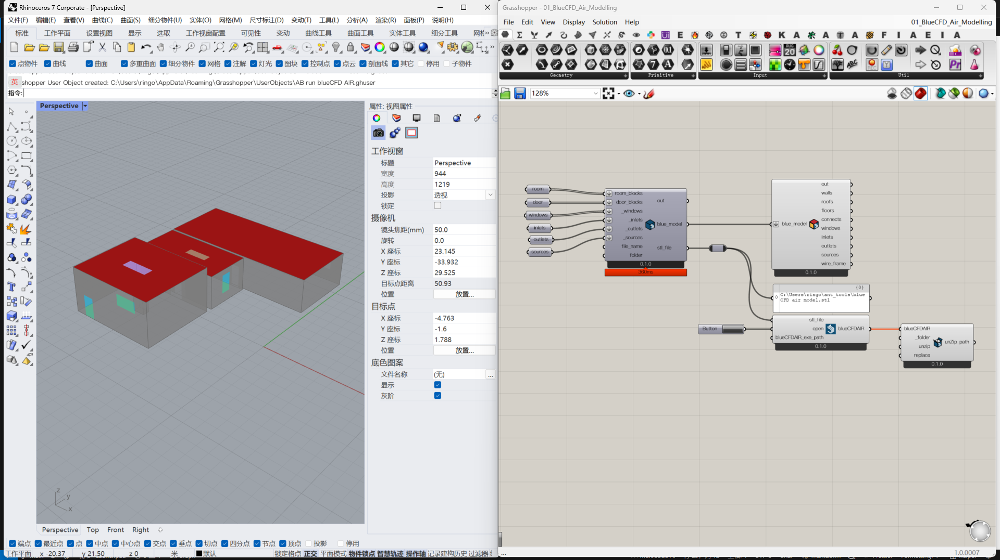

# Ant blueCFD

[English](README_EN.md)

## 简介

本项目是一个基于 Grasshopper 开发的 blueCFD AIR 建模插件，可将 Rhino/Grasshopper 中的几何模型转换为 blueCFD AIR 可识别的格式，并辅助运行模拟与结果提取。

## 功能

- 将 Grasshopper 几何模型转换为 blueCFD 几何模型；
- 对模型进行可视化，并以不同颜色区分构件；
- 调用本地安装的 blueCFD AIR 软件进行仿真；
- 解压缩仿真结果，便于使用 Paraview 等工具做后处理。

## 安装

1. 安装 blueCFD AIR；
2. 安装 blueCFD Core；
3. 安装 Rhino 7；
4. 运行 `ant_blueCFDInstaller.exe` 安装插件。

## 使用说明

1. 在 Rhino 中打开 Grasshopper；
2. 构建几何模型并使用 Ant blueCFD 组件导出；
3. 在 blueCFD AIR 中运行仿真；
4. 使用解压后的结果进行可视化后处理。

## 备注

本项目尚未在其他电脑上广泛测试，不同环境下可能存在 bug。欢迎提交问题，具体操作示例可参考 B 站视频。

