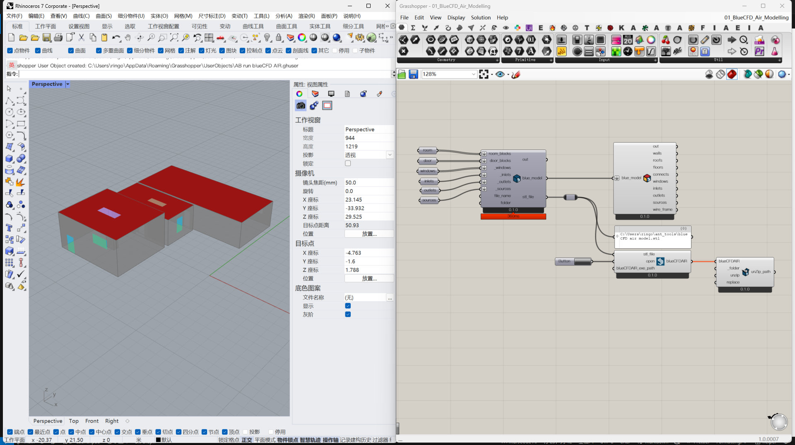

# Ant blueCFD

[中文](README.md)

## Introduction

This project is a modeling plugin for blueCFD AIR software, developed based on Grasshopper.

## Features

- Converts Grasshopper geometric models into blueCFD geometric models.
- Visualizes models with different colors for different components.
- Calls the blueCFD AIR software for simulation, requiring blueCFD AIR to be installed locally.
- Extracts simulation results for further post-processing, such as visualization using Paraview.

## Instructions

- Install blueCFD AIR software.
- Install blueCFD Core.
- Install Rhino 7.
- Download this project and save it to Rhino 7 at `C:\Users\<YourUsername>\AppData\Roaming\McNeel\Rhinoceros\7.0\scripts\`, where `<YourUsername>` is your computer username.
- Copy the `UserObjects` folder from the project into the `UserObjects` folder in Rhino 7.
- Open the `01_BlueCFD_Air_Modelling.gh` file in the Templates folder to start modeling.

As this project has not been tested on other computers, there may be some bugs depending on the environment. We welcome bug reports, and specific instructions can be found in the video on Youtube.